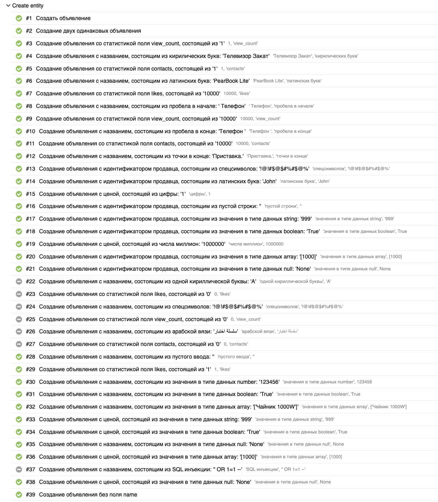
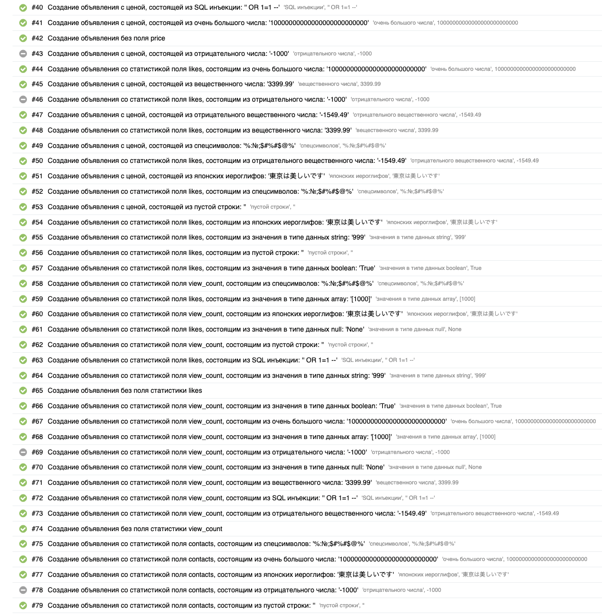
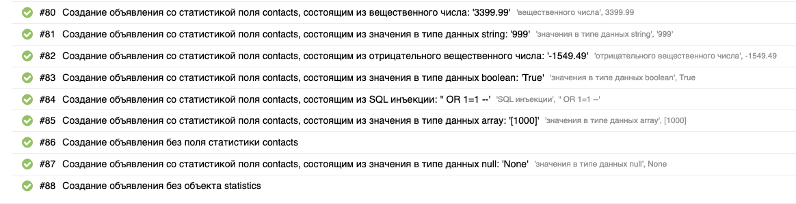
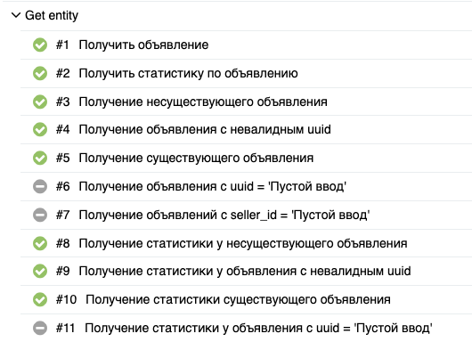
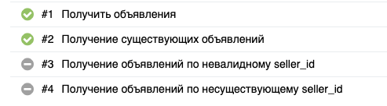
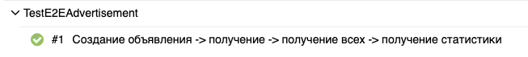

Все тест-кейсы уже автоматизитрованны и находятся в отчёте. Привык уже всё писать в код.
Оставлю здесь скриншоты из Allure

## Создание объявления:

## Получение объявления и статистики:

## Получение объявлений:

## e2e сценарий:
